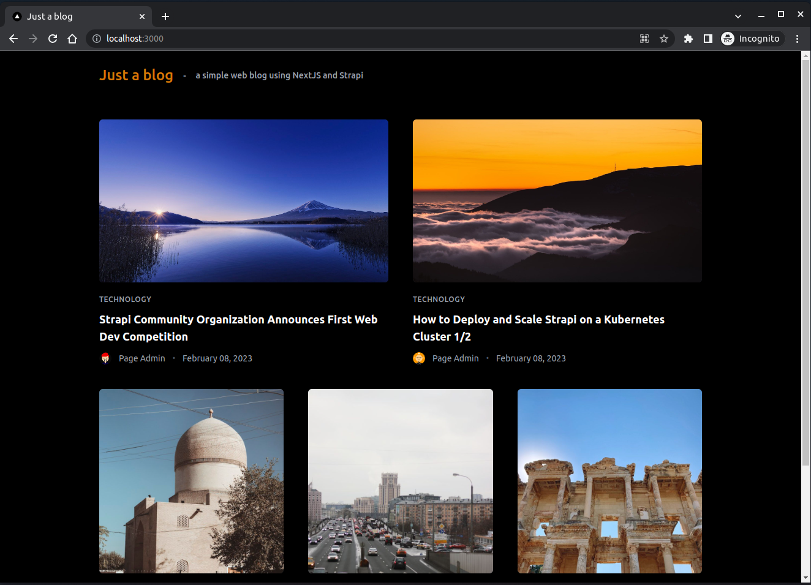

# just-a-blog
Just a blog - a simple web blog using NextJS and Strapi.




System requires:
`"node": ">=16.8.x <=18.x.x"`

## 1. Strapi
Version: 4.3.0 with Typescript.

### 1.1. Install dependencies

```sh
$ npm i
```

### 1.2. Run local
Create new file `./strapi/.env` and copy all content in `./strapi/.env.sample`, then run:

```sh
$ npm run develop
```

Strapi listens on port `1337` as default.

### 1.3. Available entities

**Category**
```json
{
    "title": {
      "type": "string"
    },
    "slug": {
      "type": "uid",
      "targetField": "title"
    },
    "color": {
      "type": "string"
    },
    "posts": {
      "type": "relation",
      "relation": "manyToMany",
      "target": "api::post.post",
      "inversedBy": "categories"
    }
  }
```

**User**
```json
{
    "name": {
      "type": "string"
    },
    "slug": {
      "type": "uid",
      "targetField": "title"
    },
    "color": {
      "type": "string"
    },
    "posts": {
      "type": "relation",
      "relation": "oneToMany",
      "target": "api::post.post",
      "inversedBy": "posts"
    }
  }
```

**Post**
```json
{
    "title": {
      "type": "string"
    },
    "description": {
      "type": "string"
    },
    "slug": {
      "type": "uid",
      "targetField": "title"
    },
    "content": {
      "type": "text"
    },
    "cover": {
      "type": "media",
      "multiple": false,
      "required": false,
      "allowedTypes": [
        "images",
        "files",
        "videos",
        "audios"
      ]
    },
    "author": {
      "type": "relation",
      "relation": "manyToOne",
      "target": "plugin::users-permissions.user",
      "inversedBy": "posts"
    },
    "categories": {
      "type": "relation",
      "relation": "manyToMany",
      "target": "api::category.category",
      "inversedBy": "posts"
    }
  }
```

### 1.4. Available apis
```
# Get all posts
curl --request GET \
  --url 'http://localhost:1337/api/posts?populate=*' \
  --header 'Content-Type: application/json'
```

### 1.5. Strapi Admin panel
[Strapi Admin panel Here](http://localhost:1337/).
Account/Password: admin@gmail.com / 12wqasxZ

## 2. NextJs
Version: 13.1.6 with `appDir` experimental feature.

### 2.1. Install dependencies

```sh
$ npm i
```

### 2.2. Run local

```sh
$ npm run dev
```

NextJS dev-server listens on port `3000` as default.
